# 极客园项目后台

本项目是一个开源项目，后端接口文档由黑马提供。供开发学习使用。

pc文档:http://geek.itheima.net/api-pc.html

移动端文档:http://geek.itheima.net/api.html

> > 技术栈 react antd 

## 登录

通过token 技术实现登录和身份验证。前端将用户名和密码发送给后端，后端生成token返回前端。之后的前端请求都将token放在请求头。

前端登录界面：

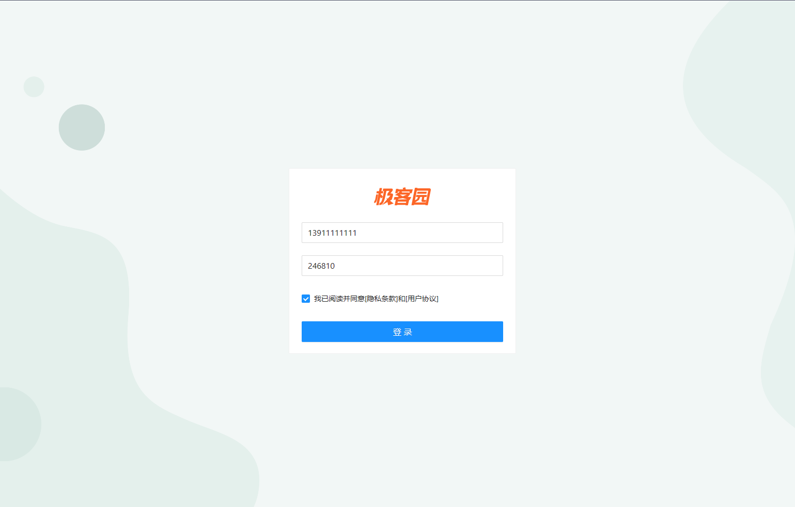

## 后台概览页面

登录成功后进入后台概览页面，相当于一个统计界面。

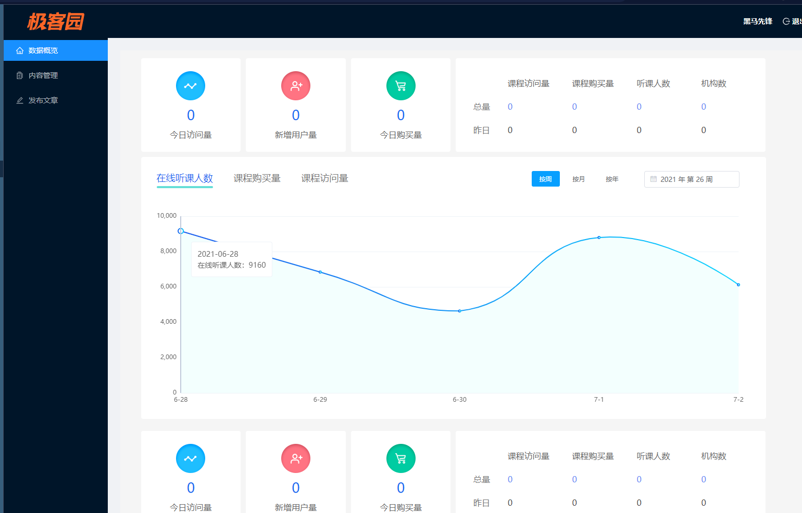

## 内容管理界面

对文章的管理界面，可以筛选，修改，删除。

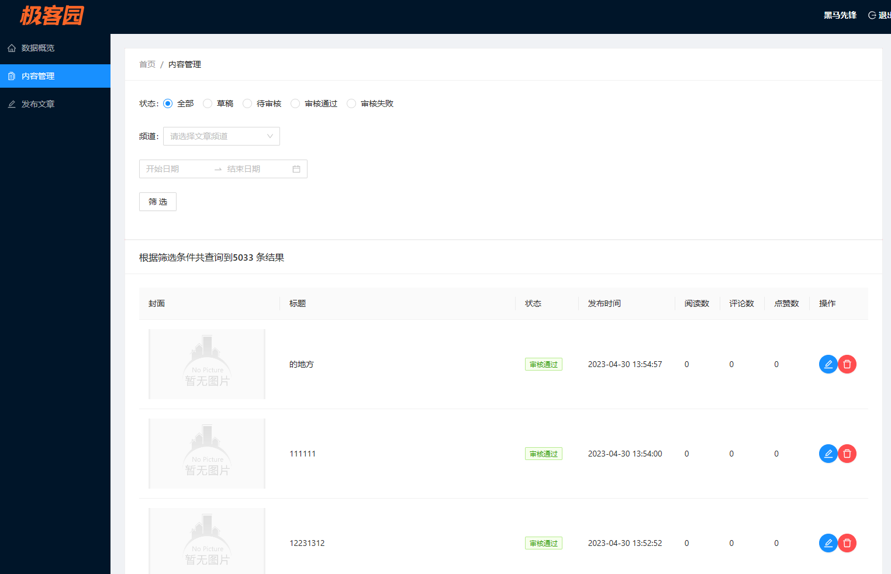

## 文章发布界面

可以在这个页面对文章进行编辑和发布

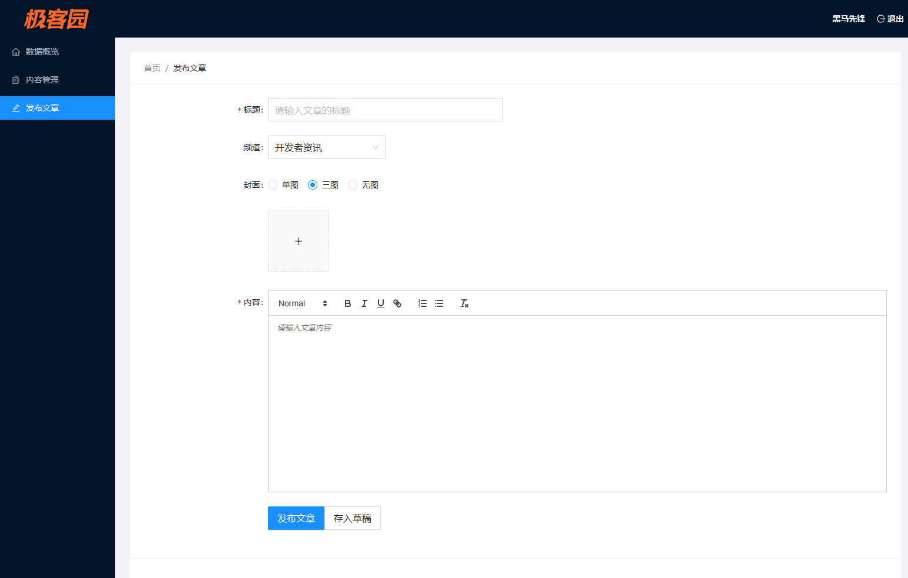

# 极客园项目h5移动端

> > 技术栈 react + antd mobile + redux

## 移动登录页面

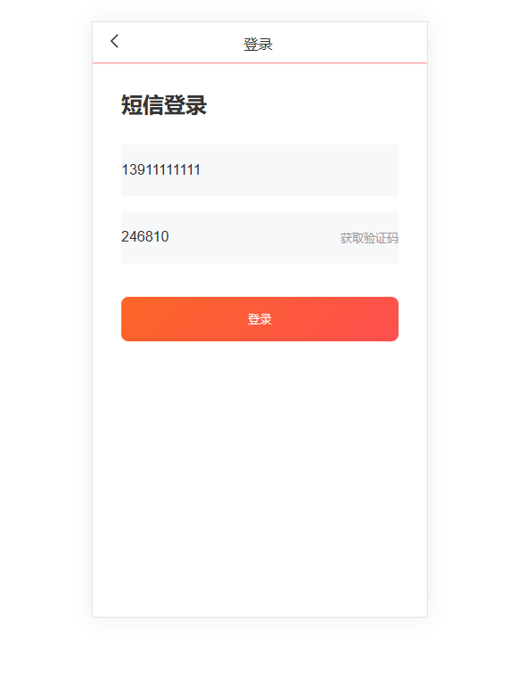

登录成功后跳转首页，进入推荐页面。

## 文章首页

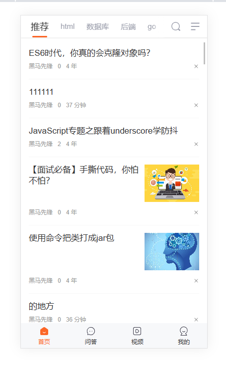

可以对上方频道进行编辑。

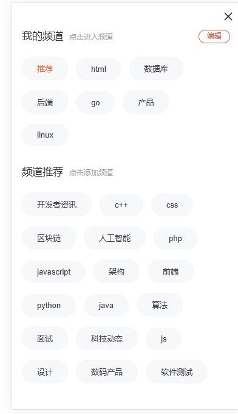

## 文章详情页面

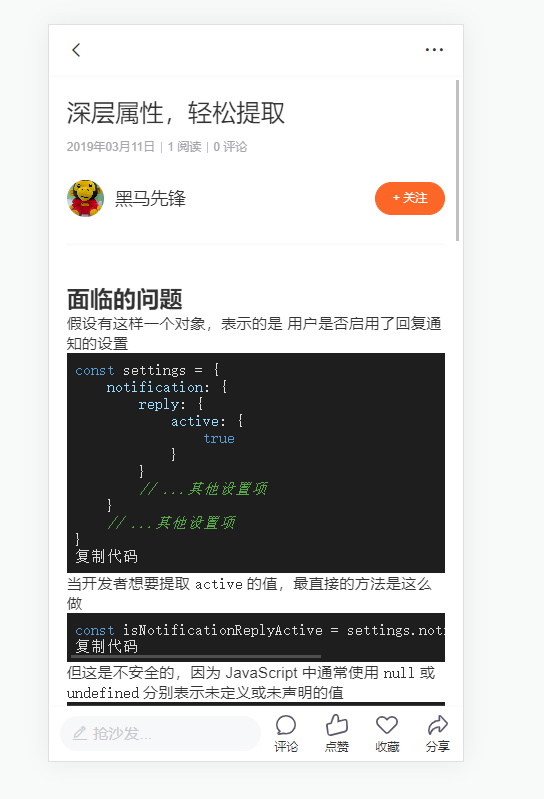

## 个人信息页面

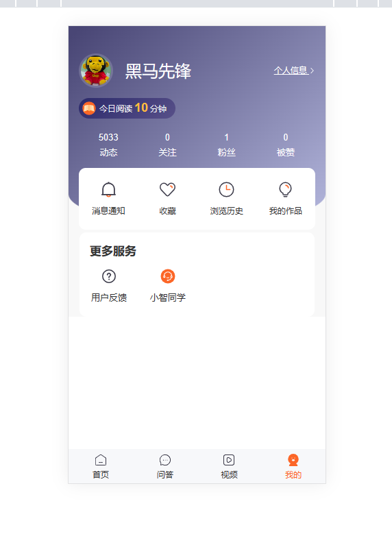

## 修改人信息页面

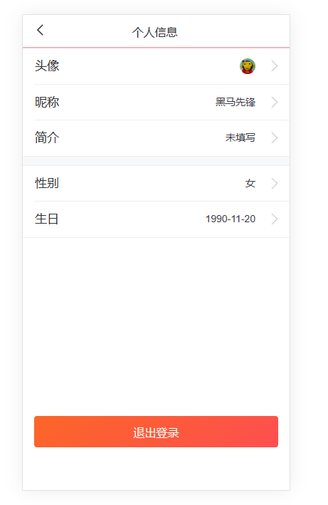

## 用户反馈页面

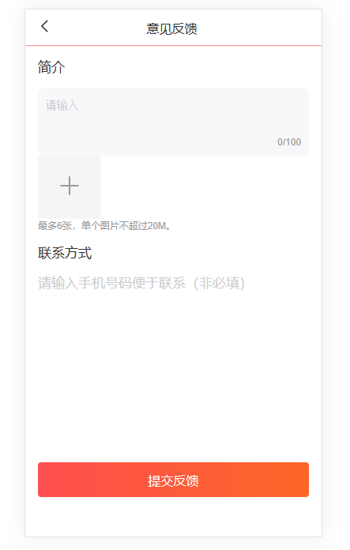

## 智能聊天机器人页面

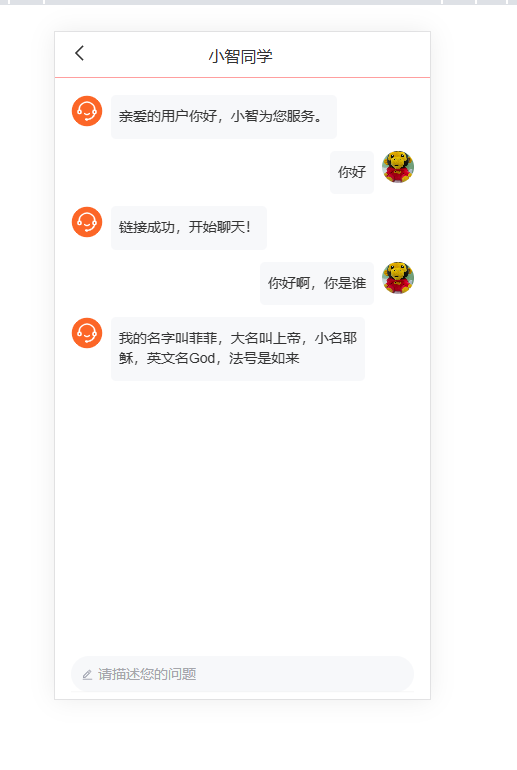